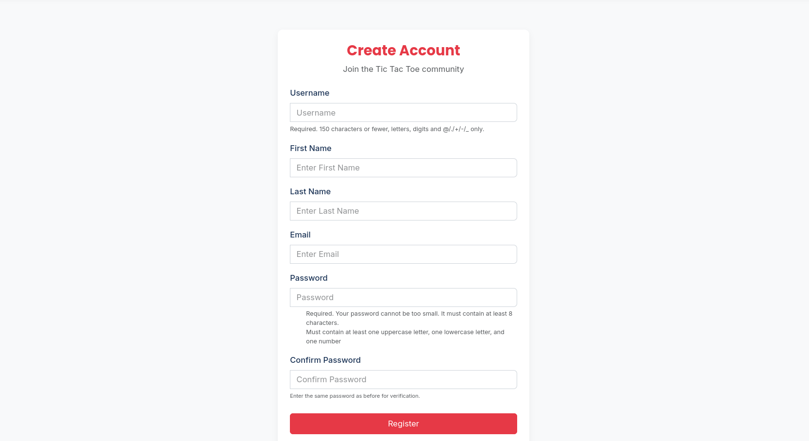

# Django Tic Tac Toe - Real-time Multiplayer Game

A real-time tic-tac-toe game built with Django and WebSockets that allows users to create games, join existing games, and play with others in real-time.

### Login Screen


### Register Screen


### Home Screen


### Game List Screen


### Game Details Screen


## Features

-   **User Authentication**: Secure registration and login system
-   **Game Creation**: Users can create new game rooms
-   **Game Discovery**: Browse and join available games
-   **Real-time Gameplay**: WebSockets-powered real-time updates
-   **Game History**: View past game results and statistics
-   **Responsive Design**: Play on any device

## Installation

### Setup

1.  Clone the repository:
    
    ```bash
    git clone https://github.com/Raksha-Karn/XOXO.git
    ```
    
2.  Create and activate a virtual environment:
    
    ```bash
    python -m venv venv
    source venv/bin/activate  # On Windows: venv\Scripts\activate
    ```
    
3.  Install dependencies:
    
    ```bash
    pip install -r requirements.txt
    ```
    
    
4.  Run migrations:
    
    ```bash
    python manage.py migrate
    ```
    
5.  Create a superuser:
    
    ```bash
    python manage.py createsuperuser
    ```
    
6.  Start the development server:
    
    ```bash
     daphne core.asgi:application
    ```
    
7.  Navigate to `http://localhost:8000` in your browser.
    


## API Endpoints

### Authentication

-   `POST /register/` - Register a new user
-   `POST /login/` - Login
-   `POST /logout/` - Logout

### Games

-   `GET /games/` - List all available games
-   `POST /games/create/` - Create a new game
-   `GET /games/<id>/` - Get game details
-   `POST /games/<id>/join/` - Join a game
